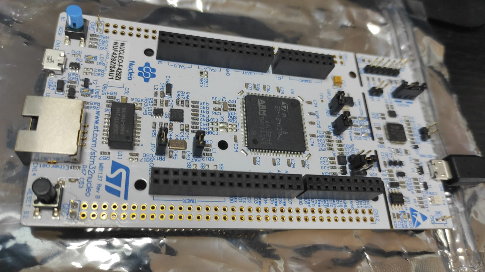

# Real Time Operating Systerm on ARM
This repository contains the custom RTOS made for my MTE241 course.

## Course Description
> This course went over computer organization and real-time systems, as well as how to build your own Real-Time Operating System from scratch, including Round-Robin and Periodic Scheduler, Earliest Deadline First schedulers, semaphores, calculate the CPU utilization of your RTOS, be able to build an OS Kernel etc.

## Hardware 
### STM32 Nucleo F429ZI
https://www.st.com/en/evaluation-tools/nucleo-f429zi.html

